# Cricket Sports Performance & Operations Intelligence Platform

> A data-driven cricket analytics and operations platform for monitoring player performance, training workload, injury availability, match statistics, and equipment management.

**Project Status:** 🟢 **V1 Completed | V2 In Progress**

---

## 📌 Project Overview

The **Cricket Sports Performance & Operations Intelligence Platform** is a data-driven analytics system designed to help cricket teams monitor and understand both **player performance and team operations** through a centralized platform.

The system combines **Python-based analytics, SQL database management, and an interactive Streamlit dashboard** to provide insights across multiple areas of cricket operations.

The platform currently supports:

* Player performance analysis
* Batting and bowling statistics
* Performance scoring
* Performance consistency analysis
* Training attendance and workload monitoring
* Player injury and availability tracking
* Match-level analysis
* Equipment inventory and assignment tracking
* Data confidence measurement

The project is being developed in multiple versions. **Version 1 focuses on the core analytics and operations platform**, while **Version 2 is being developed to extend the system toward predictive analytics and advanced decision-support capabilities.**

---

## 🎯 Objectives

The main objectives of the platform are to:

* Centralize cricket player and team data in a structured SQL database.
* Analyze batting and bowling performance using statistical metrics.
* Generate a composite player performance score.
* Measure performance consistency across multiple matches.
* Monitor training attendance, workload, and fitness.
* Track player injuries and current availability.
* Analyze match results and individual match performances.
* Manage cricket equipment, assignments, conditions, and availability.
* Provide data confidence indicators based on the amount of available performance data.
* Present analytics through an interactive dashboard.
* Build a modular foundation that can be extended with machine learning and predictive analytics.

---

# ✨ Key Features

## 🏏 Player Performance Analytics

The platform provides detailed player-level performance analysis, including:

* Batting statistics
* Bowling statistics
* Runs scored
* Wickets taken
* Batting average
* Bowling average
* Strike rate
* Economy rate
* Fours and sixes
* Dot balls
* Maidens
* Match-by-match performance trends
* Composite performance score
* Performance consistency
* Data confidence

---

## 📊 Performance Intelligence

The platform generates a composite **Performance Score** using role-specific weighting.

Different player roles receive different weighting between:

* Batting performance
* Bowling performance
* Training performance

Supported roles include:

* Batter
* Bowler
* All-rounder
* Wicketkeeper

The system also provides a **Data Confidence** measure so that performance results can be interpreted according to the amount of historical data available.

---

## 🏋️ Training & Workload

The training module tracks:

* Training sessions
* Attendance
* Missed sessions
* Attendance percentage
* Total workload
* Average workload
* Fitness rating
* Workload status
* Player-specific training profiles

Workload status is calculated relative to the overall squad workload.

---

## 🩹 Injury & Availability

The injury module provides:

* Injury history
* Recovery status
* Recovery duration
* Severe injury records
* Current player availability
* Squad availability overview
* Player-specific injury profiles

---

## 🏆 Match Analytics

The match module provides:

* Match results
* Team scores
* Opponent scores
* Match type
* Competition
* Venue
* Batting performances
* Bowling performances
* Match details

---

## 🎒 Equipment Management

The equipment module tracks:

* Equipment inventory
* Team assignment
* Player assignment
* Equipment condition
* Equipment status
* Purchase date
* Maintenance information
* Available equipment

---

# 📈 Performance Scoring

The platform calculates a **composite Performance Score** by combining batting, bowling, and training performance.

The weighting is role-dependent:

| Player Role  | Batting | Bowling | Training |
| ------------ | ------: | ------: | -------: |
| Batter       |     60% |      0% |      40% |
| Wicketkeeper |     60% |      0% |      40% |
| Bowler       |      0% |     60% |      40% |
| All-rounder  |     35% |     35% |      30% |

Individual metrics are normalized before being combined so that different statistical scales can be incorporated into a single performance score.

### Batting Score

The batting component considers:

* Total runs
* Strike rate
* Batting average

### Bowling Score

The bowling component considers:

* Wickets
* Economy rate
* Dot-ball percentage

Lower economy rate contributes positively to the bowling score through reverse normalization.

### Training Score

The training component considers:

* Attendance percentage
* Average fitness rating

The final performance score is generated according to the player's role-specific weighting.

---

# 🎯 Data Confidence

Performance scores are accompanied by a **Data Confidence** value.

This allows the platform to distinguish between performance results supported by a larger history of data and results based on limited observations.

Confidence is based primarily on the number of available:

* Batting performances
* Bowling performances
* Training sessions

Confidence levels are classified as:

* **High** — 75% or above
* **Medium** — 50% to below 75%
* **Low** — below 50%

For batters and wicketkeepers, batting match history is used as the primary performance-data basis.

For bowlers, bowling match history is used.

For all-rounders, batting and bowling match availability are combined.

---

# 📊 Performance Consistency

The platform also measures **match-to-match performance consistency**.

Consistency is calculated separately for batting and bowling.

### Batting Consistency

The batting consistency analysis considers variation in:

* Runs scored
* Strike rate

The system uses the **coefficient of variation (CV)** to measure relative variation between performances.

A higher consistency score indicates lower variation across the available performances.

### Bowling Consistency

Bowling consistency considers variation in:

* Wickets
* Economy rate

The same variation-based approach is used to produce a bowling consistency score.

### Limited Data Handling

A consistency score is only considered meaningful when at least **two relevant performances** are available.

For players with fewer than two relevant performances, the system reports a consistency score of **0** rather than presenting a potentially misleading consistency measurement.

This is why **Data Confidence** is displayed alongside consistency metrics.

---

# 🏗️ System Architecture

The platform follows a modular analytics architecture:

```
Streamlit Dashboard
        │
        ▼
Python Analytics Layer
        │
┌───────┼────────┬──────────┐
│       │        │          │
▼       ▼        ▼          ▼
```

Batting Bowling Training   Performance
Analytics Analytics       Analytics
│       │        │          │
└───────┼────────┴──────────┘
│
▼
Injury Analytics
│
▼
Match Analytics
│
▼
Equipment Analytics
│
▼
SQLAlchemy ORM
│
▼
SQLite Database

The application separates the **presentation layer**, **analytics layer**, and **database layer**, making the project easier to test, maintain, and extend.

---

# 🗄️ Database Design

The system uses a relational database containing **9 core tables**:

| Table                  | Purpose                                          |
| ---------------------- | ------------------------------------------------ |
| `teams`                | Stores team information                          |
| `players`              | Stores player profiles and roles                 |
| `matches`              | Stores match-level information                   |
| `batting_performances` | Stores player batting statistics                 |
| `bowling_performances` | Stores player bowling statistics                 |
| `training_sessions`    | Stores training session information              |
| `training_records`     | Stores player training participation and metrics |
| `injuries`             | Stores injury and recovery information           |
| `equipment`            | Stores equipment inventory and assignments       |

Foreign-key enforcement is enabled to maintain referential integrity between related records.

---

# 📁 Project Structure

```
cricket-sports-analytics/
│
├── analytics/
│   ├── __init__.py
│   ├── batting.py
│   ├── bowling.py
│   ├── training.py
│   ├── performance.py
│   ├── injury.py
│   ├── player_profile.py
│   ├── matches.py
│   └── equipment.py
│
├── database/
│   ├── __init__.py
│   ├── connection.py
│   ├── init_db.py
│   ├── models.py
│   └── seed.py
│
├── pages/
│   ├── player.py
│   ├── matches.py
│   ├── training.py
│   ├── injury.py
│   └── equipment.py
│
├── tests/
│   ├── test_batting.py
│   ├── test_bowling.py
│   ├── test_training.py
│   ├── test_performance.py
│   ├── test_injury.py
│   ├── test_matches.py
│   └── test_equipment.py
│
├── data/
│   └── cricket_analytics.db
│
├── app.py
├── README.md
├── requirements.txt
└── .gitignore
```

---

# 🛠️ Technology Stack

| Technology       | Purpose                                    |
| ---------------- | ------------------------------------------ |
| **Python**       | Core application and analytics logic       |
| **Pandas**       | Data manipulation and statistical analysis |
| **NumPy**        | Numerical calculations and normalization   |
| **SQLAlchemy**   | Database connectivity and ORM              |
| **SQLite**       | Relational database                        |
| **Streamlit**    | Interactive dashboard                      |
| **Plotly**       | Interactive charts and visualizations      |
| **Pytest**       | Automated unit testing                     |
| **Git & GitHub** | Version control and project management     |

---

# 🧪 Testing

The project includes automated unit tests covering the major analytics and database modules.

The current test suite contains **36 tests** covering:

* Batting analytics
* Bowling analytics
* Training analytics
* Performance scoring
* Performance consistency
* Injury analytics
* Match analytics
* Equipment analytics

Current test result:

```
36 passed
```

Testing also covers important edge cases, including players with limited performance data.

---

# 📸 Dashboard Screenshots

The platform provides an interactive **Streamlit dashboard** with separate modules for player analytics, matches, training, injury management, and equipment management.

## Main Dashboard

The main dashboard provides a squad-level overview of:

* Player performance
* Performance confidence
* Training workload
* Workload vs performance
* Player availability
* Match results
* Performance consistency

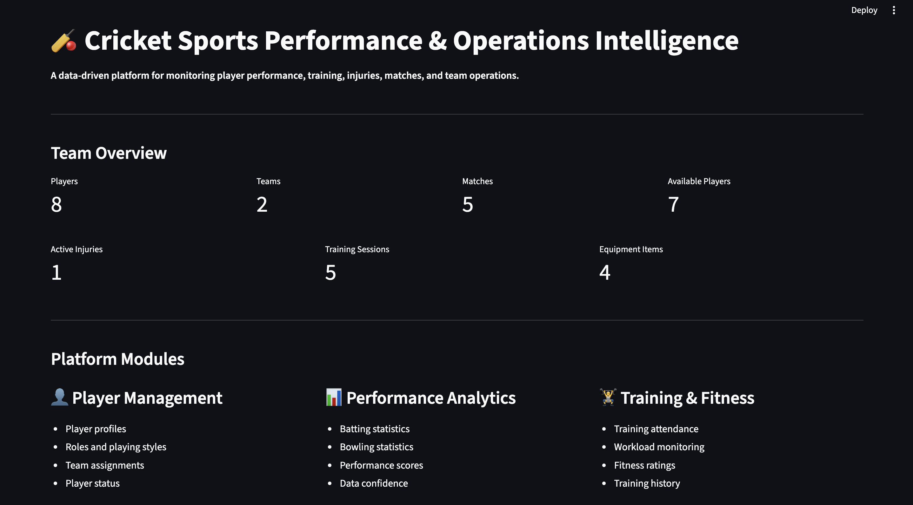

---

# 👤 Player Analytics

The Player Analytics module provides an individual player profile containing:

* Player information
* Performance score
* Data confidence
* Batting statistics
* Bowling statistics
* Performance consistency
* Match-by-match performance trends
* Training and fitness information
* Injury and availability information

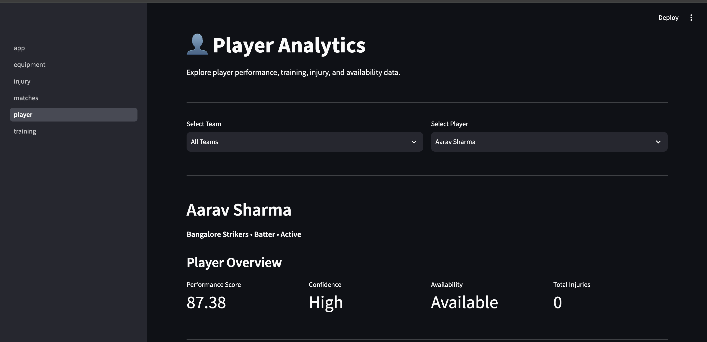

### Performance Trends

The platform visualizes match-by-match batting performance using runs and strike rate.

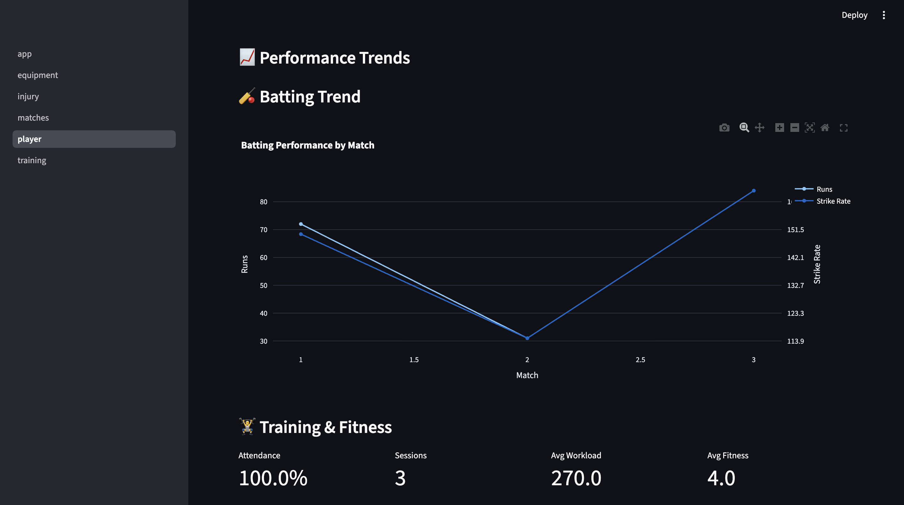

---

# 🏆 Match Analytics

The Match Analytics module provides match-level analysis including:

* Match result
* Team and opponent scores
* Competition
* Venue
* Match type
* Batting performances
* Bowling performances
* Match details

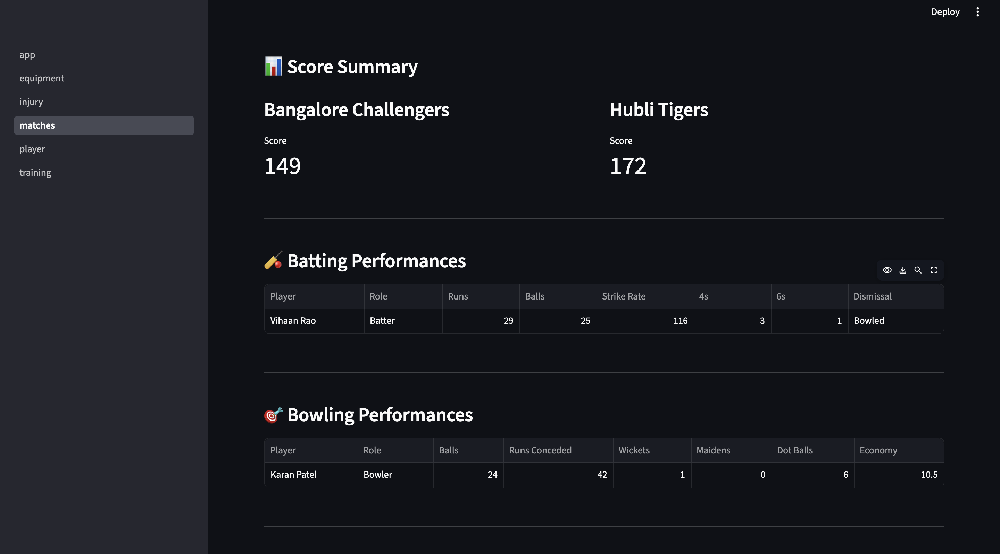

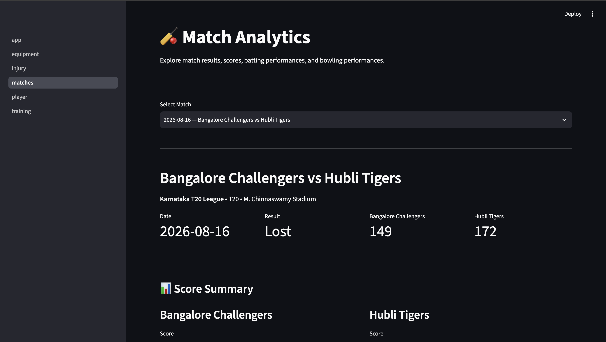

---

# 🏋️ Training & Workload

The Training module tracks player training participation and workload.

It includes:

* Training sessions
* Attendance
* Workload
* Fitness
* Player training profiles
* Training statistics
* Workload visualization

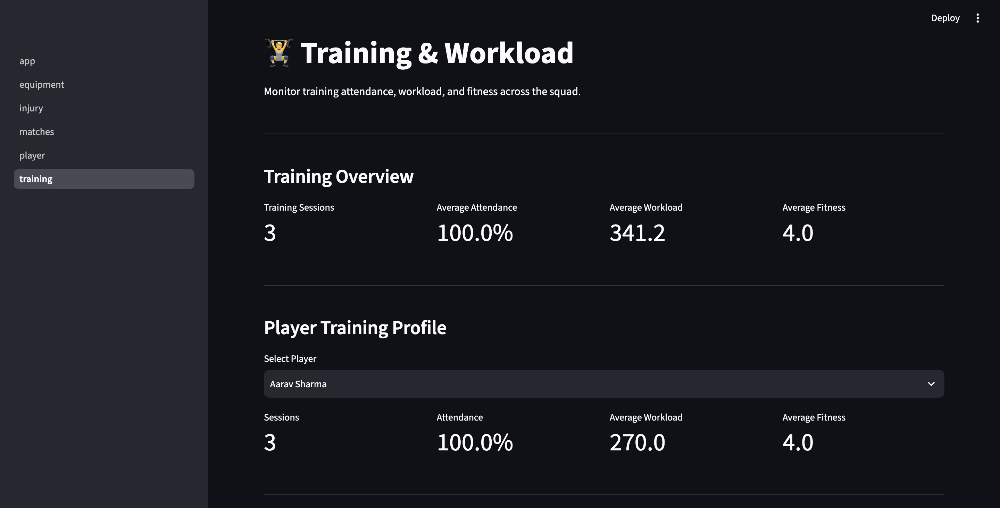

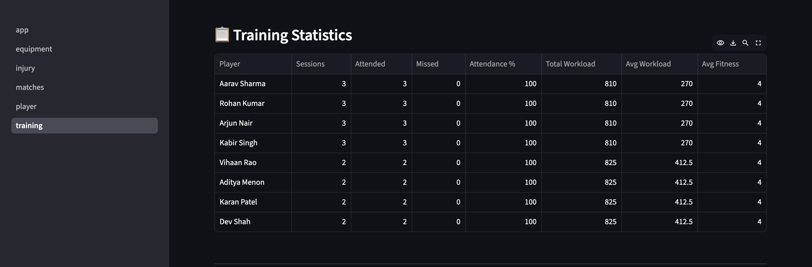

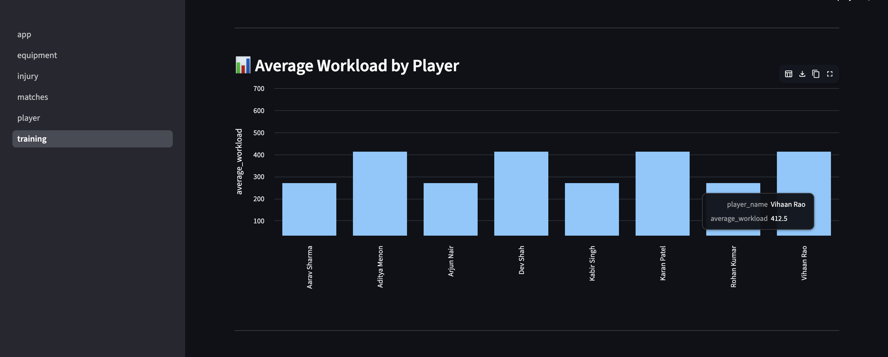

---

# 🩹 Injury & Availability

The Injury module provides a squad-level view of player availability and injury history.

It includes:

* Total injuries
* Recovered injuries
* Recovering players
* Average recovery duration
* Current player availability
* Injury statistics
* Severe injury records
* Individual injury profiles

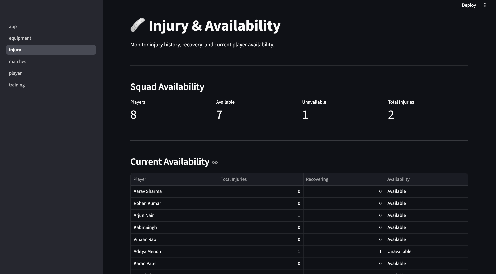

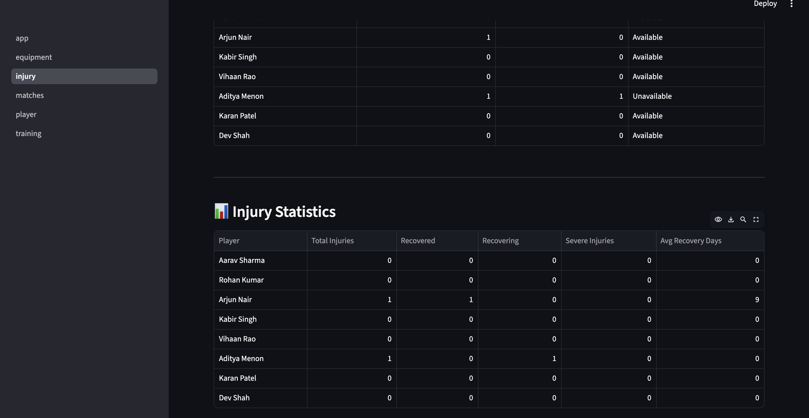

---

# 🎒 Equipment Management

The Equipment module provides inventory and assignment tracking.

It includes:

* Total equipment
* Assigned equipment
* Available equipment
* Equipment condition
* Equipment status
* Player assignments
* Available inventory

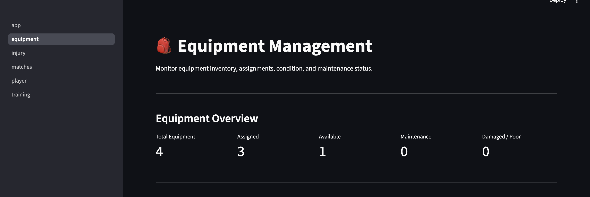

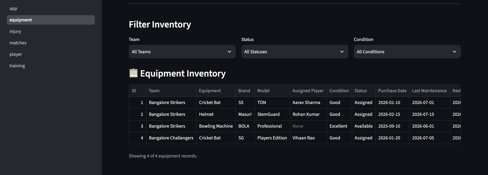

---

# 💻 Installation & Setup

## 1. Clone the Repository

```
git clone https://github.com/banavii/cricket-sports-analytics.git

cd cricket-sports-analytics
```

## 2. Create the Conda Environment

```
conda create -n cricket-analytics python=3.12
```

## 3. Activate the Environment

```
conda activate cricket-analytics
```

## 4. Install Dependencies

```
pip install -r requirements.txt
```

---

# 🗄️ Database Initialization

Initialize the database using:

```
python database/init_db.py
```

This creates the SQLite database and required tables.

To populate the development database with the project dataset:

```
python database/seed.py
```

The database is stored at:

```
data/cricket_analytics.db
```

---

# ▶️ Run the Application

Start the Streamlit application using:

```
streamlit run app.py
```

The application will open in the browser at the local Streamlit address provided in the terminal.

---

# 🧪 Run Tests

To run the complete test suite:

```
pytest
```

For more detailed output:

```
pytest -v
```

Expected current result:

```
36 passed
```

---

# 📊 Current Development Data

Version 1 uses a controlled development dataset designed to demonstrate the functionality of the platform.

Current data includes:

* **2 teams**
* **8 players**
* **5 matches**
* **10 batting performance records**
* **6 bowling performance records**
* **5 training sessions**
* **2 injury records**
* **4 equipment records**

The dataset is structured to provide different player roles, performance levels, training workloads, injury states, and equipment assignments for testing and dashboard demonstration.

---

# 🚀 Version 1 — Completed

Version 1 establishes the core analytics and operations platform.

### Completed V1 Components

* [x] Relational database design
* [x] SQLAlchemy models
* [x] SQLite database
* [x] Team management
* [x] Player management
* [x] Batting analytics
* [x] Bowling analytics
* [x] Training analytics
* [x] Performance scoring
* [x] Data confidence calculation
* [x] Performance consistency analysis
* [x] Injury tracking
* [x] Player availability tracking
* [x] Match analytics
* [x] Equipment management
* [x] Streamlit dashboard
* [x] Interactive visualizations
* [x] Modular analytics architecture
* [x] Automated testing
* [x] 36 passing tests

---

# 🔄 Version 2 — In Progress

Version 2 focuses on extending the platform from descriptive analytics toward **predictive and decision-support capabilities**.

Planned V2 development includes:

* Historical performance expansion
* Larger datasets
* Advanced player performance trends
* Predictive performance modelling
* Machine learning integration
* Workload and performance forecasting
* More advanced player comparison
* Predictive injury-related analytics
* Advanced match analytics
* Improved filtering and dashboard interactions
* PostgreSQL support for larger-scale deployment

The V2 architecture is intended to build on the existing V1 analytics and database foundation rather than replacing it.

---

# 🔮 Future Enhancements

Potential future improvements include:

### 🤖 Machine Learning

* Player performance prediction
* Match performance forecasting
* Player form prediction
* Workload-performance modelling
* Predictive analytics based on historical match data

### 📈 Advanced Analytics

* Player comparison tools
* Role-based player analysis
* Performance trend detection
* Advanced workload analysis
* Long-term performance tracking

### 🩺 Injury Analytics

* Historical injury pattern analysis
* Workload-related injury indicators
* Recovery trend analysis
* Availability forecasting

### 🏏 Match Intelligence

* Opposition analysis
* Venue-based performance analysis
* Phase-wise batting and bowling analysis
* Match situation analysis
* Historical head-to-head analysis

### 🗃️ Database & Deployment

* PostgreSQL migration
* Larger production datasets
* Cloud database integration
* Authentication and role-based access
* Production deployment

---

# 📌 Project Status

| Component               | Status         |
| ----------------------- | -------------- |
| Database Architecture   | ✅ Completed    |
| SQLAlchemy Models       | ✅ Completed    |
| Batting Analytics       | ✅ Completed    |
| Bowling Analytics       | ✅ Completed    |
| Training Analytics      | ✅ Completed    |
| Performance Scoring     | ✅ Completed    |
| Data Confidence         | ✅ Completed    |
| Performance Consistency | ✅ Completed    |
| Injury Analytics        | ✅ Completed    |
| Match Analytics         | ✅ Completed    |
| Equipment Management    | ✅ Completed    |
| Streamlit Dashboard     | ✅ Completed    |
| Automated Testing       | ✅ Completed    |
| V1                      | 🟢 Completed   |
| V2                      | 🔄 In Progress |
| Machine Learning        | 🔄 Planned     |
| Predictive Analytics    | 🔄 Planned     |
| PostgreSQL              | 🔄 Planned     |

---

# 📚 Key Analytics Concepts Used

The project applies several data analytics and software engineering concepts:

* Relational database design
* SQL querying
* Object-relational mapping
* Data normalization
* Statistical aggregation
* Coefficient of variation
* Performance scoring
* Role-based weighting
* Data confidence measurement
* Descriptive analytics
* Data visualization
* Modular software architecture
* Unit testing
* Edge-case handling

---

# 🎯 Project Goal

The long-term goal of the project is to develop a unified **Cricket Sports Performance & Operations Intelligence Platform** capable of supporting both performance analysis and operational decision-making.

The current V1 provides the foundation for this system through structured data management, descriptive analytics, interactive visualization, and automated testing.

V2 will build upon this foundation by introducing larger datasets, predictive analytics, and machine learning capabilities.

---

# 👨‍💻 Author

**Banavi**

BCA | Data Science & Analytics Enthusiast

Interested in:

* Data Analytics
* Machine Learning
* Python
* SQL
* Sports Analytics
* Data-driven applications

---

# 📄 License

This project is developed for **academic, portfolio, and learning purposes**.
